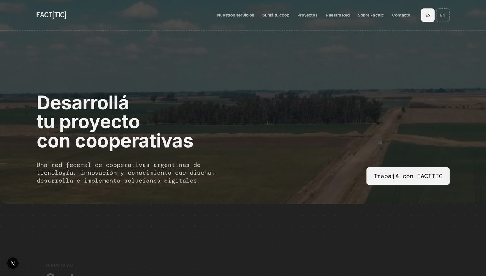

<div align="center">

# FACT[TIC]

**Federación Argentina de Cooperativas de Trabajo de Tecnología, Innovación y
Conocimiento**

Una red federal de cooperativas argentinas que diseña, desarrolla e implementa
soluciones digitales.

[**facttic-web.vercel.app**](https://facttic-web.vercel.app) ·
[Sumá tu cooperativa](https://facttic-web.vercel.app/suma-tu-coop) ·
[Proyectos](https://facttic-web.vercel.app/proyectos) ·
[Contacto](https://facttic-web.vercel.app/contacto)

[](LICENSE)
[](https://nextjs.org)
[](#licencia)



</div>

## Qué es FACTTIC

Una federación de **cooperativas de trabajo argentinas** que producen
tecnología de otra manera: sin dueños, con decisiones tomadas en asamblea y con
los ingresos distribuidos entre quienes hacen el trabajo.

Cuántas son y dónde están se ve en
[Nuestra Red](https://facttic-web.vercel.app/nuestra-red), que lo dibuja en un
mapa federal.

Lo que la vuelve una federación y no una lista es el sexto principio
cooperativo, el de cooperación entre cooperativas: para un proyecto grande se
arma un **equipo intercoop** entre varias, cada una aportando lo suyo, en vez de
competir por él.

**Trabaja en cinco líneas** —desarrollo de software, diseño y comunicación,
datos e inteligencia artificial, capacitación y consultoría, e ingeniería e
infraestructura— **y en tres verticales**: organizaciones, agro y financiero.

> ¿Tu cooperativa hace tecnología? [Sumate a la red](https://facttic-web.vercel.app/suma-tu-coop).
> ¿Tenés un proyecto? [Escribinos](https://facttic-web.vercel.app/contacto).

## Sobre este repositorio

El sitio público de la Federación. El contenido —cooperativas, proyectos,
novedades, servicios— vive en una API propia; esto es el frontend.

Sale en dos idiomas: el español sin prefijo y el inglés bajo `/en`, con los
nombres de sección traducidos —`/proyectos` se publica como `/en/projects`—.

Está hecho con [Next.js](https://nextjs.org) y
[Tailwind CSS](https://tailwindcss.com), en TypeScript.

## Levantarlo

Hace falta **Node 20 o superior** y **pnpm**.

```bash
pnpm install
cp .env.example .env.local
pnpm dev
```

Queda en <http://localhost:3000>. Se puede trabajar con `.env.local` casi
vacío: el sitio lee la API sin credencial, porque sus GET son públicos.

En <http://localhost:3000/componentes> está el catálogo de componentes, con
datos reales: es el lugar para ver qué hay antes de escribir algo nuevo.

## Cómo está organizado

```
app/                   las páginas, bajo [idioma] para los dos idiomas
components/ui/         primitivos: botón, chip, campo, tarjeta…
components/tarjetas/   componentes de dominio
components/secciones/  bloques grandes de página
lib/api/               transporte: habla HTTP y autentica
lib/dominio/           traducción: de la forma de la API al modelo del sitio
lib/datos/             acceso: lo único que importan las vistas
lib/contenido/         los textos fijos, uno por idioma
lib/mapa/              los límites de las provincias, para Nuestra Red
app/globals.css        tokens de color y escala tipográfica
```

La capa de datos está partida en tres a propósito, para que un cambio del
backend se resuelva en un solo archivo. Está explicado en
[`lib/README.md`](lib/README.md); los componentes, en
[`components/README.md`](components/README.md).

## Licencia

### El código

Software libre, bajo la **GNU Affero General Public License v3.0 o posterior**
([AGPL-3.0-or-later](https://www.gnu.org/licenses/agpl-3.0.html)). El texto
completo está en [`LICENSE`](LICENSE).

Se eligió la AGPL y no la GPL porque esto es una página web: la GPL obliga a
publicar los cambios a quien **distribuye** el código, y servir un sitio no
cuenta como distribuirlo. Con la AGPL, quien tome este código, lo modifique y lo
ponga online tiene que publicar sus cambios igual. Es la misma razón por la que
el sitio traduce con LibreTranslate y no con un servicio cerrado.

### El contenido

Una licencia de software no alcanza para lo que no es software, así que:

- **Los textos** del sitio —los de [`lib/contenido/`](lib/contenido) y los
  cargados por la Federación— se pueden reusar y adaptar bajo
  [CC BY-SA 4.0](https://creativecommons.org/licenses/by-sa/4.0/deed.es):
  citando a FACTTIC y compartiendo igual.
- **El logo, el wordmark FACT[TIC] y la identidad visual** quedan reservados.
  Se pueden reproducir para hablar de la Federación, no para presentarse como
  ella ni para firmar un sitio derivado: quien levante este código tiene que
  poner su propia marca.
- **Las fotos y los logos de cada cooperativa** son de cada una, no de
  FACTTIC, y no están en este repositorio: los carga cada cooperativa por la
  API. Reusarlos se arregla con su dueña.

<div align="center">

Hecho de forma intercooperativa 🤝

</div>
